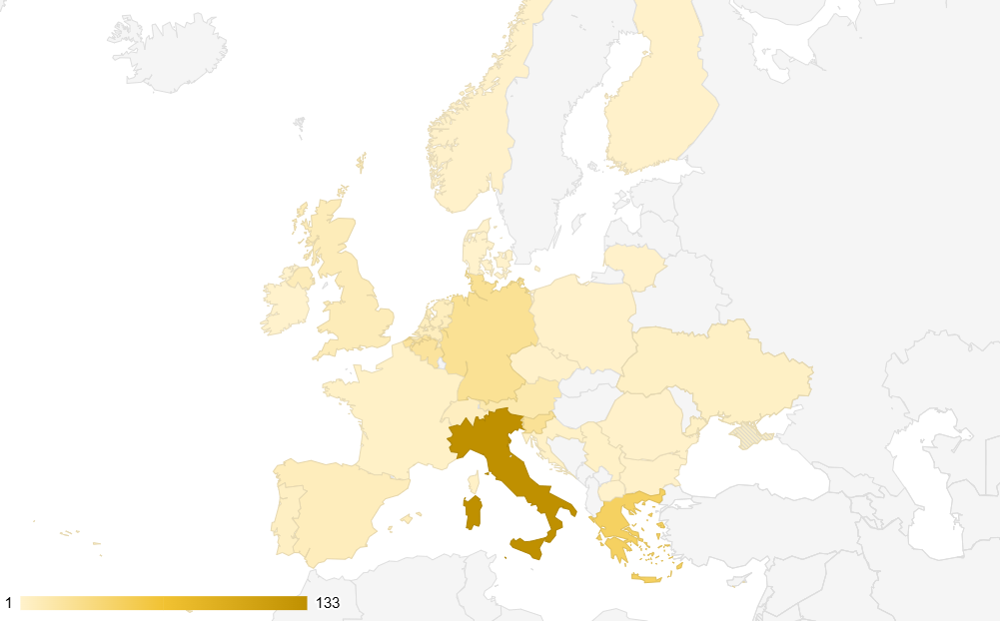
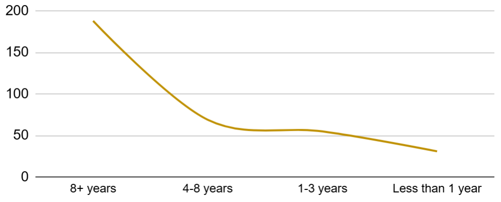
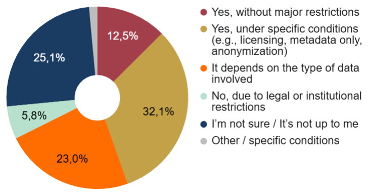

# General Results

Full visualisations for this section are available in the dedicated Google Sheets workspace:

[General Results – Google Sheets tab](https://doi.org/10.5281/zenodo.20682292)

## 2.1 Respondent profile

The survey collected **343 responses** from professionals across **33 countries** (**Figure 1**). Italy represented the largest group (**38.8%**), followed by Greece (**13.7%**), Germany (**7.3%**), Slovenia (**7.0%**), and Belgium (**6.1%**). Additional responses were received from several other European countries, as well as North America and Asia.

  
  
<em>Figure 1. Geographic distribution.</em>

The gender distribution was predominantly female, followed by male respondents, with a small share preferring not to disclose gender.

Most respondents were aged **35–44** (**27.4%**) or **45–54** (**28.9%**), with younger professionals (**25–34**) representing **22.2%** and senior respondents (**55+**) **18.4%**. Only **1.2%** were under 25.

Educational levels were generally high: nearly half holding a **PhD (47.8%)**, followed by **Master’s degrees (39.1%)** and **Bachelor’s degrees (8.2%)**.

Respondents worked across diverse institutional settings. The largest groups came from universities (**26.1%**), research institutes (**17.6%**), public administration (**16.6%**), private companies (**11.6%**), and museums (**10.4%**).

Participants identified themselves across four broad professional domains:

1. Conservation and Collection Care (28.3%)
2. Research and Education (27.7%)
3. Technical and Digital Innovation (27.4%)
4. Administration and Management (16.6%)

Professional experience (**Figure 2**) varied: more than half (**54.8%**) had **8+ years of experience**, followed by medium-career practitioners (**4–8 years: 20.1%**), early-career professionals (**1–3 years: 16%**), and newcomers (**less than 1 year: 9%**).

  
  
<em>Figure 2. Professional experience.</em>

## 2.2 Engagement indicators

A majority of respondents (**61.2%**) subscribed to the ARTEMIS newsletter. Interest in participating in pilot case studies was also significant, with **43%** of respondents indicating preliminary willingness to be involved.

Regarding data sharing (**Figure 3**), **12.5%** were open to sharing data without major restrictions, while **32%** would share under specific conditions. A further **23%** stated that willingness depends on the type of data involved. Only **6%** reported that sharing was not possible due to legal or institutional constraints, while **25%** were unsure or noted that the decision did not fall within their responsibilities.

  
  
<em>Figure 3. Willingness to share data.</em>

Among respondents who expressed some level of willingness to share data and were therefore asked a follow-up question, 64.8% indicated interest in proposing a pilot case study within the ARTEMIS project, while 35.2% did not.
