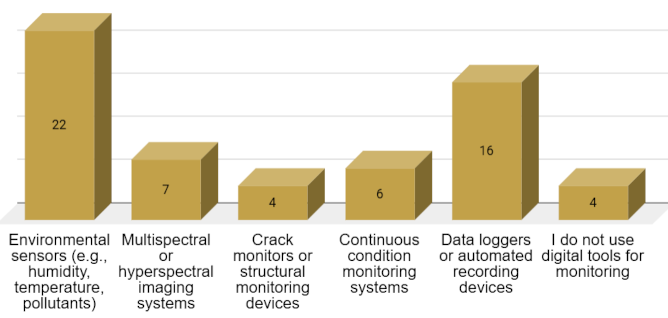
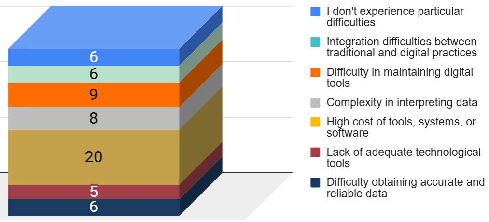
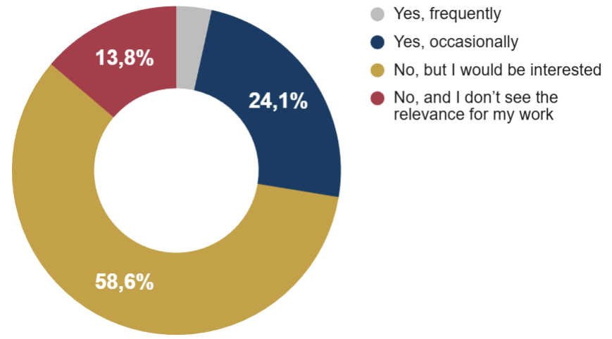
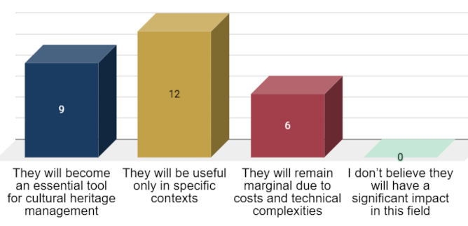
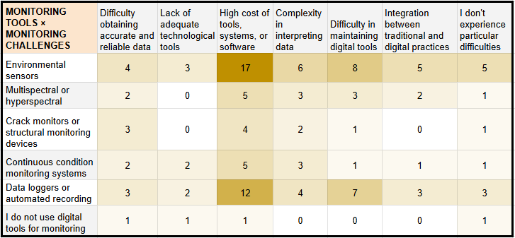
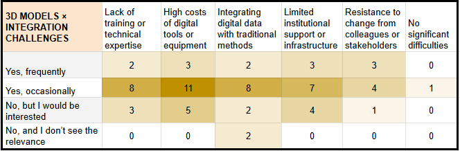

# Conservator / Restorer

Full visualisations for this profile are available in the dedicated Google Sheets tab:

[Conservator / Restorer – Google Sheets tab](https://docs.google.com/spreadsheets/d/1ifbaVbV-15UzVqxh6cpbuYBN5vWL3QNB4iis-Lq3_gk/edit?gid=922967408#gid=922967408)

A total of **29 respondents** identified themselves as **Conservator/Restorer**. The Conservator/Restorer respondents represent a specialised group working primarily with the **material preservation of artworks, artefacts, and built heritage components**. They possess strong technical backgrounds and typically operate in contexts where **documentation, diagnostic imaging, and condition assessment** are central to daily practice. Their digital engagement reflects the tools and constraints characteristic of hands-on conservation work.

## 3.1.1 Digital tools, data practices, and monitoring approaches

Conservators make regular use of digital technologies, with **high-resolution photography** emerging as the most widespread tool, followed by **digital microscopy**, **multispectral imaging**, and – among more specialised users – **spectroscopic analysis** or **3D modelling**.

Data are generally collected manually or at specific moments of the conservation workflow, while **continuous or sensor-based acquisition** is limited to environmental monitoring setups.

Condition monitoring practices (**Figure 4**) rely largely on **environmental sensors** and **data loggers**, whereas structural or hyperspectral monitoring remains less common.

  
  
<em>Figure 4. Digital tools and monitoring practices among Conservator/Restorer respondents.</em>

The main challenges in monitoring conditions (**Figure 5**) reported include the **high cost of equipment**, difficulties in maintaining digital tools, and the **complexity of interpreting diagnostic data**, especially when integrating digital and traditional conservation practices.

  
  
<em>Figure 5. Main challenges in monitoring conditions and preservation environments.</em>

## 3.1.2 Data practices and data formats

Conservators work with a wide variety of data types, primarily **high-resolution photographic documentation** and **historical records**, which remain the backbone of conservation workflows. Many also rely on **environmental monitoring data** and on results from **chemical or physical analyses**, while more advanced datasets – such as **3D scans**, **spectroscopic data**, or **scientific imaging** – are used by smaller but significant groups.

The formats in which these data are stored are equally diverse, with a predominance of **unstructured files** and **tabular datasets**, followed by scientific image formats and, to a lesser extent, **3D file types** or proprietary software outputs.

Use of formal standards or interoperability protocols is very limited: most conservators do not apply specific frameworks, and only a few report occasional use of **IIIF**, **CIDOC CRM**, or persistent identifiers such as **DOI/ARK**.

## 3.1.3 Data accessibility and data-sharing practices

Data accessibility among conservators is generally limited: only a small group works with **fully structured and searchable digital systems**, while most operate with **partially digitised material** or with documentation dispersed across non-interoperable platforms.

Collaborative tools are not yet widespread – very few use internal or external digital platforms, although a substantial number express interest in adopting them in the future.

The main obstacles to sharing conservation data relate to the **lack of adequate digital infrastructure** and **limited cross-institutional collaboration**, followed by legal and institutional restrictions, compatibility issues, and concerns about intellectual property. Only a minority reports experiencing no barriers.

## 3.1.4 3D models, digital simulations, and integration challenges

The use of **3D models** among conservators remains limited: most employ them only occasionally, and several would be interested in exploring them but have not yet incorporated them into their workflow.

Digital simulations (**Figure 6**) – such as modelling degradation or testing restoration scenarios – are even less common, with only a few practitioners having experimented with them. Interest, however, is present, indicating potential for growth if adequate support becomes available.

  
  
<em>Figure 6. Use of digital simulations among Conservator/Restorer respondents.</em>

The main barriers to adopting these technologies are the **high cost of tools**, the **lack of training or technical expertise**, and difficulties in integrating digital data with traditional documentation methods. **Limited institutional support** and, to a lesser extent, **resistance to change** also hinder wider implementation.

## 3.1.5 Digital Twins: perceived value, expectations, and future adoption

Conservators express **strong interest** in the potential applications of **Digital Twins**, particularly for **documentation**, **training**, and the **simulation of environmental or material degradation processes**. Virtual testing of restoration scenarios and real-time monitoring of conservation conditions are also seen as promising areas, while only one respondent sees no relevant use.

Expectations focus on having access to **updated condition data**, **deterioration forecasts**, **alerts on critical changes**, and tools to compare before/after states or test treatment options, as well as integrated access to historical conservation records.

Looking ahead, most conservators believe Digital Twins will be useful (**Figure 7**) – either broadly or in selected contexts – although a smaller group anticipates that adoption may remain limited due to cost or technical complexity; none expect them to have no impact at all.

  
  
<em>Figure 7. Perceived future usefulness of Digital Twins among Conservator/Restorer respondents.</em>

## 3.1.6 Cross-analysis insights

All detailed cross-tabulations for this profile are available in the corresponding Google Sheets tab.

These insights derive from comparative cross-tabulations across the profile-specific tables. The analysis focuses on relative response distributions within each row to identify structural patterns across technological groups, rather than relying on absolute counts.

- The cross-tabulation confirms a coherent alignment between the type of technologies used and the corresponding categories of scientific data handled, rather than a clear expansion in the overall diversity of data types.

- The comparison across monitoring tools (**Table 1**) shows differentiated patterns of difficulty: **environmental sensors** are mainly associated with **high costs**, **data loggers** with maintenance burdens, and **continuous monitoring systems** with data interpretation challenges, suggesting a potential gap between technological capability and organisational capacity.

  
  
<em>Table 1. Monitoring tools vs. monitoring challenges among Conservator/Restorer respondents.</em>

- While specialised formats are used for specific data types (such as scientific imaging and 3D scans), unstructured files remain systematically present across all categories. This suggests that documentation-driven practices continue to play a central role, with structured data often being re-integrated into narrative formats, potentially constraining full interoperability. The very low adoption of standards observed across the profile reinforces the broader picture of structural fragmentation. Even among respondents who use advanced imaging or 3D tools, the limited use of shared protocols coexists with the persistent reliance on unstructured formats, potentially weakening interoperability across workflows.

- Respondents who use **3D models** (**Table 2**) report significant challenges related to **costs**, **institutional support**, and **integration with traditional documentation practices**. These patterns suggest that 3D adoption is associated with organisational and infrastructural demands that remain only partially supported.

  
  
<em>Table 2. Use of 3D models vs. integration challenges among Conservator/Restorer respondents.</em>

- Across respondents, simulations are consistently associated with structural constraints, particularly **costs** and **institutional support**. Even among active users, simulation practices are not frictionless, suggesting that organisational conditions remain a key factor in their broader adoption.

- Perceptions of Digital Twin use cases vary according to the level of 3D adoption. Frequent users tend to associate Digital Twins with operational functions such as **monitoring** and **simulation**, while occasional or prospective users more often emphasise **documentation** and **training** purposes. Rejection of potential applications is minimal across the group.
