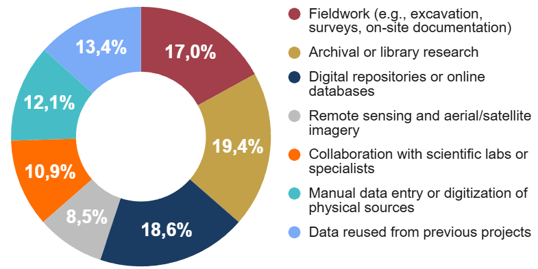
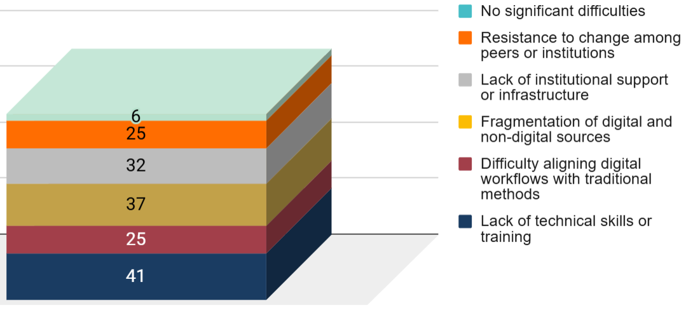

# Historians and archaeologists

Full visualisations for this profile are available in the dedicated Google Sheets tab.

https://docs.google.com/spreadsheets/d/1ifbaVbV-15UzVqxh6cpbuYBN5vWL3QNB4iis-Lq3_gk/edit?gid=1883828773#gid=1883828773

Historians and archaeologists, **64 respondents**, represent one of the largest groups, with a strong methodological diversity ranging from archival research to field–based documentation. Their digital practices span GIS, 3D reconstruction, remote sensing, text analysis, and extensive use of online heritage databases. This group combines traditional scholarly approaches with increasingly data–driven methods, making it one of the profiles with the widest spread of digital tool adoption.

## 3.5.1 Digital tools, data access, and field documentation

Historians and archaeologists use a broad and mature digital ecosystem, reflecting both field–based and desk–based research practices. **GIS** is by far the dominant technology, followed closely by digital archives, online databases, and tools for accessing large collections of digitised sources. Techniques such as **3D modelling**, **photogrammetry**, and **digital text analysis** are also widely adopted, underlining the methodological shift toward spatial, visual, and semantic computation in historical and archaeological research.

Data acquisition (**Figure 20**) is highly diversified: respondents combine fieldwork (excavation, surveying, direct documentation), library and archival research, digital repositories, and reused datasets from previous projects. This hybrid workflow mirrors the interdisciplinary nature of the field. Drone–based mapping, GPS/total stations, and remote sensing are also common, though a notable minority still reports not using digital tools for site monitoring.

  
  
<em>Figure 20. Methods for collecting or accessing digital resources.</em>

The main challenges in using digital tools concern practical implementation rather than conceptual integration. **Insufficient training** is the most widespread difficulty, followed by the high cost of tools, software, and infrastructure. Many respondents also face fragmented datasets distributed across multiple platforms or formats, as well as the significant time required to maintain digital documentation workflows. Additional obstacles emerge when digital methods must be aligned with traditional research practices or when institutional support is limited. Only a very small share of respondents reports no significant difficulties.

## 3.5.2 Data types, formats, and standards

Historians and archaeologists work with a wide variety of data types, reflecting both text–based scholarship and field documentation. Their core materials remain textual and visual sources, but large portions of the group also handle geospatial datasets, scientific analyses, stratigraphic information and, increasingly, 3D models. This confirms the hybrid nature of research practices in this profile, where traditional evidence and digital outputs coexist.

Data are available in many different formats, ranging from text documents and tabular datasets to geospatial layers, multimedia files and 3D models. The variety is broad, but highly uneven: structured metadata and semantic formats are used only by a minority, indicating that interoperability is not yet standardised across the field.

Standards adoption reflects the same pattern. While some respondents use Dublin Core, CIDOC CRM, TEI or ARIADNE schemas, the majority do not follow any specific protocol. This suggests that, despite a rich digital ecosystem, data management practices remain fragmented and often dependent on individual projects rather than shared disciplinary frameworks.

## 3.5.3 Data accessibility, collaboration, and data–sharing challenges

Historian and archaeologist respondents report a mixed level of digital structuring in their datasets. Some work within organised, searchable systems, while many others rely on information dispersed across multiple platforms or held in partially digitised collections. A smaller group continues to operate with largely unstructured or physical materials, reflecting the persistence of traditional archival and field documentation practices.

Collaborative platforms are used by a substantial portion of the profile, both through institutional systems and external tools such as GitHub, OpenContext or Wikidata. However, an equally large segment has interest in adopting such platforms but does not currently use them, suggesting that technical or organisational barriers still limit broader engagement.

Data–sharing difficulties are widespread and multifaceted. Respondents point to infrastructural limitations, institutional restrictions, compatibility issues across software ecosystems, and concerns over intellectual property. Limited openness or collaboration within the research community also emerges as a significant obstacle. Only a small minority reports having no specific difficulties, indicating that data sharing remains one of the most problematic aspects of digital research workflows in this field.

## 3.5.4 3D models, simulations, and integration challenges

Use of **3D modelling** is widespread among historians and archaeologists, with most respondents reporting at least occasional experience and very few seeing no relevance for their work. Digital simulations, while less established, show a strong emerging interest: only a small share use them frequently, but the majority either already experiment with them or would be interested in doing so. This indicates that simulation–based approaches are perceived as promising but remain limited by access, skills or project scope.

The challenges associated (**Figure 21**) with integrating these tools into research are substantial. Insufficient technical training is the most common barrier, followed by difficulties in aligning digital outputs with traditional analytical workflows. Many respondents highlight persistent fragmentation between digital and non-digital sources, reflecting the complex documentation landscape typical of historical and archaeological research. Limited institutional support and cultural resistance within the field also hinder more systematic adoption. Only a small minority reports no major difficulties, confirming that the transition toward digitally integrated research remains uneven.

  
  
<em>Figure 21. Main challenges in integrating digital technologies.</em>

## 3.5.5 Digital Twins: use cases, expectations, and future outlook

Historian and archaeologist respondents see clear value in simulation–based tools, especially for improving documentation, supporting interpretation, and enhancing communication with the public. Most consider simulations relevant for reconstructing historical contexts or visualising site evolution, and only a very small number do not see meaningful applications. These perceptions reflect the established role of virtual reconstruction and spatial modelling in the discipline.

Digital Twins are associated with a wide set of potential uses. Respondents point above all to spatial, topographical and historical datasets, followed by stratigraphic information, environmental factors and models of human activity. The ability to integrate heterogeneous sources emerges as a central expectation, together with the potential for collaborative multi–institutional research and, to a lesser extent, real–time monitoring through sensor data.

Views on the future impact of Digital Twins are mixed. Some respondents expect them to become an essential tool for research and public engagement, while others see them as useful only in specific contexts or remain uncertain. A smaller group anticipates that costs and complexity may limit adoption. Overall, the profile shows a strong conceptual interest but a cautious outlook regarding practical implementation.

## 3.5.6 Cross–analysis insights

All detailed cross–tabulations for this profile are available in the corresponding Google Sheets tab.

https://docs.google.com/spreadsheets/d/1ifbaVbV-15UzVqxh6cpbuYBN5vWL3QNB4iis-Lq3_gk/edit?gid=1585991865#gid=1585991865

These insights derive from comparative cross-tabulations across the profile-specific tables. The analysis focuses on relative response distributions within each row to identify structural patterns across technological groups, rather than relying on absolute counts.

- Unlike more generalist profiles, digital practices among historians and archaeologists are functionally segmented, with distinct technologies associated with specific data domains (documentary, spatial, 3D, or semantic).

- Data collection methods align strongly with tool usage: GIS and digital archives are used both in fieldwork and archival research, while photogrammetry and 3D scanning are mainly tied to survey activities on site. Digital text analysis tools are primarily associated with archival and repository-based research, reinforcing the functional differentiation of digital practices.

- Reported challenges differ by tool type. Drone-based survey tools are primarily associated with access barriers – notably lack of technical training, high costs, and institutional limitations – whereas GIS and survey equipment users report more systemic difficulties, particularly data fragmentation alongside resource and infrastructure constraints. Non-users, in contrast, identify lack of expertise as the dominant obstacle.

- Data formats are highly fragmented across all categories, with the same content often distributed across text documents, spreadsheets, geospatial formats, 3D models, and multimedia files. Textual and tabular formats remain dominant even for data types that are natively structured or spatial, reinforcing the persistence of documentation-centred practices.

- Reported sharing difficulties vary by adoption status: institutional platform users primarily indicate infrastructure and compatibility issues, while respondents interested in adopting collaborative platforms express stronger concerns related to legal restrictions and intellectual property.

- Integration challenges related to 3D models and simulations are primarily skill-based among occasional and prospective users, with lack of technical expertise emerging as the dominant barrier. Even frequent users report persistent difficulties, particularly linked to the fragmentation of digital and non-digital sources and the alignment of digital workflows with traditional research practices.
