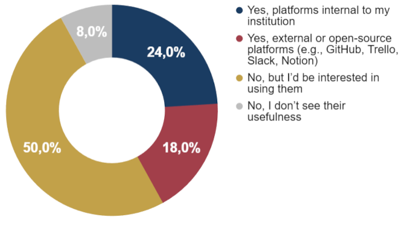
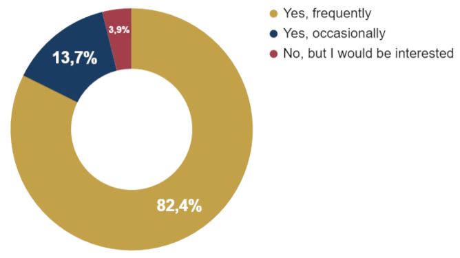
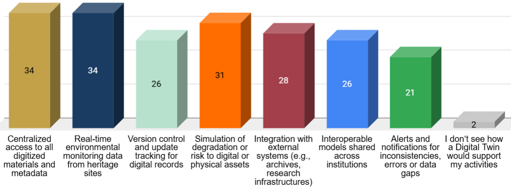
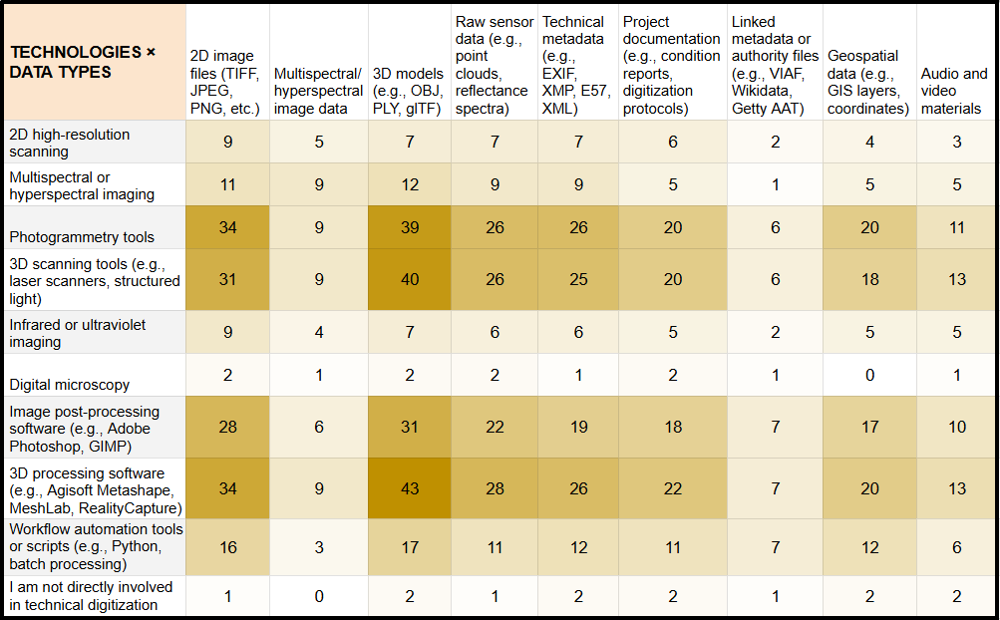

# Digitisation experts

Full visualisations for this profile are available in the dedicated Google Sheets tab.

[Digitization experts – Google Sheets tab](https://docs.google.com/spreadsheets/d/1ifbaVbV-15UzVqxh6cpbuYBN5vWL3QNB4iis-Lq3_gk/edit?gid=572765000#gid=572765000)

This profile includes **51 respondents**. Digitisation experts represent one of the most technologically specialised groups in the survey. Their work spans high–resolution imaging, **3D digitisation**, workflow automation and the management of large collections of digital assets. Respondents operate across cultural institutions, research centres and digital production environments, where digitisation is both a technical practice and a key component of documentation, preservation and public access strategies.

## 3.7.1 Digital tools, data collection, monitoring and challenges

Digitisation specialists operate within a highly technical ecosystem dominated by **3D workflows**. **Photogrammetry** and **3D scanning** form the backbone of their activity, supported by extensive use of 3D processing software and image post–production environments. Advanced imaging techniques such as multispectral acquisition are present but less uniformly adopted, while automation scripts and batch–processing tools are used by a substantial minority, signalling an increasing move toward workflow optimisation.

Data acquisition is overwhelmingly manual or organised through scheduled digitisation campaigns, with only a smaller portion of respondents working with real–time or automated systems. This indicates that digitisation remains a largely controlled, task–based process rather than a continuous data stream.

Digitisation workflows monitoring practices focus primarily on file quality control and metadata auditing, although a notable share of respondents does not use any dedicated monitoring tools at all. This confirms that quality assurance procedures are unevenly structured across institutions.

The main challenges reported in monitoring or ensuring data quality reflect structural rather than technical pressures: the absence of standardised quality–control protocols, limited staff time for thorough review, and insufficient automated validation tools. Persistent issues with metadata consistency and integration between digitisation workflows and institutional data–management systems further constrain the reliability and scalability of digital outputs.

## 3.7.2 Data types, formats and standards

Digitisation experts work with a highly diverse and technically demanding range of outputs. Unsurprisingly, **2D images** and **3D models** constitute the core of their production, with 3D formats emerging as the most common output across respondents. Many practitioners also manage raw sensor data, technical metadata, and geospatial or project documentation, reflecting the multi–layered nature of contemporary digitization workflows.

Data delivery formats closely mirror this diversity: standard image formats and 3D models dominate, while RAW files, proprietary software outputs, and tabular datasets highlight the coexistence of archival preservation requirements, technical processing needs, and institutional constraints. Structured metadata formats such as XML, RDF, or JSON appear in a more limited but meaningful subset of cases, typically in more mature or interoperable environments.

The picture changes sharply when looking at standards and interoperability practices. A clear majority of respondents do not work with any established metadata or interoperability standard, suggesting that digitization outputs – despite being technically advanced – are often not embedded in wider organisational data ecosystems. Among those who do adopt standards, usage is scattered across frameworks such as Dublin Core, CIDOC CRM, IIIF, OGC formats, and Linked Data models, with no single widely adopted protocol. This fragmentation reinforces the gap between high–end digitization techniques and the comparatively uneven standardisation landscape in heritage institutions.

## 3.7.3 Data accessibility, collaboration and sharing barriers

Access to digitised data among digitization experts is highly uneven. While many respondents work within structured archives or institutional repositories, an equally large share still manages files in loosely organised folders or unstructured environments. Only a minority operates through dedicated DAM systems or institution–wide platforms, and fragmented storage across multiple systems remains common – highlighting persistent gaps in interoperability and long–term data governance.

Collaboration practices follow a similar pattern (**Figure 27**). Although some teams rely on internal or open–source platforms for coordination, the majority expresses interest in adopting such tools but has not yet done so. This suggests that collaborative infrastructures are either underdeveloped or unevenly supported within institutions.

  
  
<em>Figure 27. Collaborative digital platform usage.</em>

Barriers to data sharing are substantial and widely experienced. Respondents point to infrastructural limitations, compatibility issues, and institutional restrictions as the most significant obstacles. Concerns about intellectual property and metadata inconsistency further complicate dissemination, while limited cross–institutional collaboration reinforces the siloed nature of digitisation work. Only a very small number reports no major difficulties, confirming that data sharing remains one of the most structurally constrained areas in digitization workflows.

## 3.7.4 3D models, simulations, and integration challenges

Digitisation experts make extensive use of **3D technologies** (**Figure 28**). The overwhelming majority works frequently with 3D models, reflecting the central role of photogrammetry and 3D scanning in contemporary digitisation workflows. Digital simulations are less established but show clear potential: while only a smaller fraction uses them regularly, many respondents express strong interest in adopting simulation–based approaches for quality control, workflow optimisation, or virtual testing environments.

  
  
<em>Figure 28. Use of 3D models.</em>

The main integration challenges relate to organisational and infrastructural constraints rather than to the digitisation tools themselves. Respondents point to fragmented workflows across departments, the absence of shared data models and interoperability standards, and limited technical support as key barriers. Difficulties arise when aligning digitised outputs with curatorial or archival requirements, and resistance to adopting new digital workflows further slows integration. Only a small minority reports no significant issues, indicating that institutional alignment remains one of the most complex aspects of digitisation practice.

## 3.7.5 Digital Twins: expectations, uses, and future outlook

For digitisation experts, **Digital Twins** are perceived primarily as tools that could strengthen data integration, preservation planning, and cross–institutional collaboration. Respondents show strong interest in applications that combine visualisation with long–term preservation modelling, and in systems capable of integrating heterogeneous outputs – images, 3D models, metadata, and analytics – into unified, interoperable environments. Public engagement and reuse in AR/VR contexts are seen as additional, though secondary, opportunities.

Expectations for Reactive Digital Twins centre on practical workflow support (**Figure 29**): a unified point of access for all digitised materials and metadata, real–time environmental information from sites, and mechanisms for version control, error detection, and consistency checks. Integration with external archives and research infrastructures is considered crucial, alongside the possibility of sharing interoperable models across institutions.

  
  
<em>Figure 29. Information or support expected from Reactive Digital Twins.</em>

Looking ahead, most respondents anticipate that Digital Twins will become essential for ensuring data continuity and long–term preservation, even if some foresee more selective adoption depending on institutional capacity. Only a very small minority doubts their relevance.

## 3.7.6 Cross analysis insights

All detailed cross–tabulations for this profile are available in the corresponding Google Sheets tab.

[Digitization experts – Google Sheets tab](https://docs.google.com/spreadsheets/d/1ifbaVbV-15UzVqxh6cpbuYBN5vWL3QNB4iis-Lq3_gk/edit?gid=803554354#gid=803554354)

These insights derive from comparative cross-tabulations across the profile-specific tables. The analysis focuses on relative response distributions within each row to identify structural patterns across technological groups, rather than relying on absolute counts.

- High–volume 3D pipelines depend heavily on specialised processing software, which appears systematically linked to multimodal data (3D, raw sensor data, metadata, geospatial layers). This indicates that the core complexity of digitisation work lies in processing, validating, and integrating heterogeneous datasets rather than in capture alone.

- Quality control remains fragmented, with challenges distributed across lack of standard procedures, insufficient automation, and poor integration with data–management systems. Tools for QC, metadata validation, and file integrity monitoring all register significant difficulties, showing no single solution currently provides end–to–end reliability.

- Sharing barriers differ by platform type and adoption level: internal platforms are more frequently associated with legal and intellectual property constraints, whereas external platforms and prospective users emphasise infrastructure limitations and technical compatibility issues.

- 3D acquisition and processing workflows show the strongest and most consistent cross–data associations (**Figure 30**), particularly linking 3D models, raw sensor data, technical metadata, and geospatial information. Rather than replacing 2D imaging, these workflows integrate it within broader multimodal digitization pipelines.

  
  
<em>Figure 30. Cross-tabulation (digital tools or technologies vs. data types).</em>

- Despite the technical maturity of 3D acquisition and processing pipelines, data capture remains predominantly manual or campaign-based, with real-time automated systems playing a comparatively minor role across core tools.

- Digital Twin use is primarily understood as an extension of existing 3D digitisation infrastructures. Digital Twins are widely perceived as a natural evolution of current digitization pipelines rather than a disruptive innovation.

- Despite the technical sophistication of digitization workflows, structured metadata formats (e.g., XML, RDF, JSON) do not dominate across data categories. Even 3D models and raw sensor data remain strongly associated with standard image and proprietary formats, indicating that semantic and interoperable data infrastructures are still unevenly implemented.
