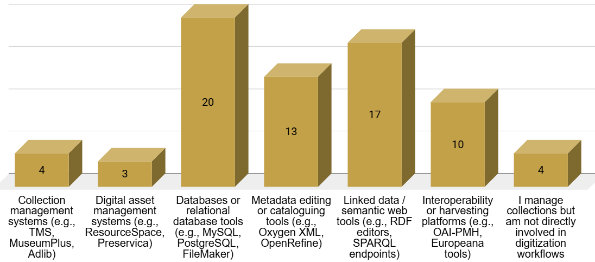
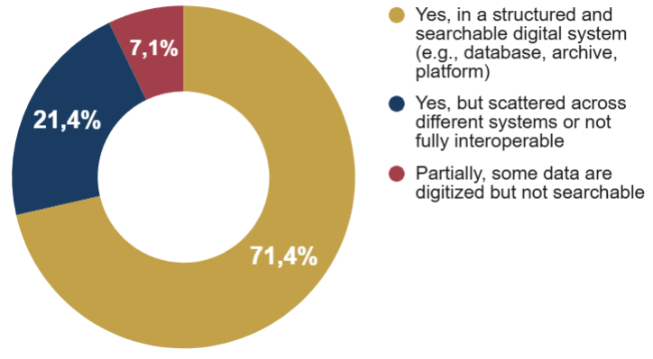
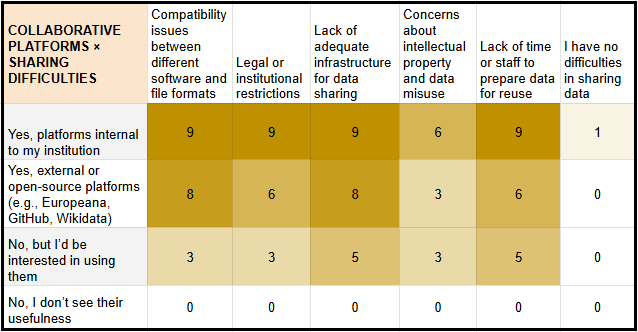

# Database and digital collection managers

Full visualisations for this profile are available in the dedicated section:

[Database and digital collection managers](https://doi.org/10.5281/zenodo.20681714)

Database and digital collection managers operate at the intersection of **data curation**, **metadata structuring**, and **long–term accessibility**. Their role is centred on maintaining the integrity, interoperability, and sustainability of digital heritage records, with a strong emphasis on **standardised data models**, **controlled vocabularies**, and **system integration**. The 28 responses reflect a group with a high level of technical responsibility and a clear awareness of the infrastructural demands of digital preservation.

## 3.8.1 Use of digital tools, collection workflows, and monitoring practices

Respondents rely primarily on **database environments** and **semantic web tools** (**Figure 31**), with **relational databases** emerging as the core infrastructure supporting their work. **Metadata editing platforms** and **linked–data technologies** are also widely used, signalling a strong orientation toward structured, interoperable collection management rather than digitization itself. Traditional **CMS/DAMS tools** appear in a smaller portion of the sample, reflecting the technical diversity of institutional setups.

  
  
<em>Figure 31. Digital tools or technologies.</em>

Data ingestion workflows vary considerably: most institutions rely on mixed pipelines combining **batch imports**, **manual uploads**, and automated processes where available. Fully **real–time ingestion** remains rare, underscoring the limited penetration of sensor–based or automated acquisition in this professional area.

Practices to monitor status, access and integrity are heterogeneous. Some respondents employ repository systems with built–in monitoring functions, while others use **metadata validation tools**, audit utilities, or preservation–oriented **file integrity checks**. However, a substantial share reports not using any digital monitoring tools at all, indicating uneven adoption across institutions.

Monitoring and managing challenges cluster around the complexity of managing heterogeneous data ecosystems. Issues include **incompatible formats**, **inconsistent metadata**, and difficulties connecting internal databases with external platforms. Limited staff capacity and gaps in training further complicate workflows, while only a small minority report no major obstacles.

## 3.8.2 Data types, formats, and standards

Database and collection managers work with a wide spectrum of digital heritage data, but the core of their activity is clearly **metadata–centred**. Structured cataloguing records, **linked data resources**, scientific datasets, and geospatial information form the backbone of the collections they maintain, while high–resolution images, archival documentation, and **3D assets** complement this technical landscape. The diversity of materials reflects the cross–institutional nature of their workflows and the need to accommodate different disciplinary inputs.

The formats in which these data are stored reinforce this picture: structured metadata formats (**XML, JSON, RDF**) and relational databases are the most common foundations of their digital ecosystems. Unstructured files and multimedia formats remain widespread, indicating that many institutions still operate hybrid workflows. **Linked Open Data formats** are also well represented, confirming the move toward interoperable and publishable datasets, while proprietary formats persist in specialised contexts.

The adoption of standards is uneven but substantial (**Figure 32**). **CIDOC CRM** and semantic–web frameworks are among the most widely used, followed by **IIIF**, **OAI–PMH**, and general metadata standards such as **Dublin Core**. Only a small group reports not using any formal standards, underlining the professional orientation of this profile toward long–term interoperability and structured data governance.

  
  
<em>Figure 32. Standard or protocols.</em>

## 3.8.3 Data accessibility and data sharing

Digital collection managers operate in environments where **structured, searchable systems** are the norm (**Figure 33**). Most respondents work within well–defined digital repositories or database–driven platforms, though a smaller group still faces fragmentation across multiple systems. Fully unstructured or non–digital holdings are essentially absent in this profile, confirming its high level of digital maturity.

  
  
<em>Figure 33. Data structure and accessibility.</em>

Collaboration is equally embedded in their workflows. Many rely on institutional platforms, while a substantial share also uses external or open–source environments such as **Europeana**, **GitHub**, or **Wikidata** to facilitate data exchange, aggregation, or publication.

The barriers they encounter are largely infrastructural and organisational rather than technical. **Inadequate infrastructures for data sharing**, compatibility issues, and limited staff capacity to prepare reusable datasets emerge as the most widespread obstacles. Institutional or legal restrictions and **intellectual–property concerns** further complicate cross–platform exchange. Only a negligible number of respondents reports no significant barriers, highlighting the structural nature of these constraints.

## 3.8.4 Use of 3D, simulations, and integration challenges

Use of advanced digital technologies among collection managers is present but uneven. A consistent group works with **3D models** – mostly occasionally rather than routinely – while others express interest but have not yet adopted these tools. **Digital simulations** remain far less established, with most respondents either unfamiliar with them or simply not using them in their current workflows.

The main integration challenges point clearly to systemic and institutional factors. **Interoperability gaps** between platforms and standards are the most frequently cited issue, followed closely by difficulties in reconciling legacy data with newer systems. Limited resources – both in terms of staff time and technical support – further hinder integration efforts, particularly when major data migrations or cross–departmental coordination are required. Training gaps and fragmentation of responsibilities across departments add additional layers of friction.

## 3.8.5 Expectations and perceived value of Digital Twins

Collection managers identify the greatest potential of **Digital Twins** in improving accessibility, interoperability, and the integration of heterogeneous datasets. Respondents see strong value in tools that can unify diverse information streams – metadata, 3D assets, geospatial layers, documentation – into coherent, navigable environments. Collaboration across institutions is also viewed as a major opportunity, particularly where shared models could help harmonize standards and enable more consistent data reuse.

A **Reactive Digital Twin** is expected to provide practical, workflow–oriented support rather than abstract simulations. Key expectations include the aggregation and visualization of multi–source data, automated alerts on metadata gaps or inconsistencies, and tools to guide preservation and curation strategies. Integration with **semantic web infrastructures** is another priority, reflecting the growing relevance of linked data in collection management.

Looking ahead, respondents remain divided (**Figure 34**): some foresee a central role for Digital Twins in future preservation and data–management strategies, while others expect adoption to remain limited to specific use cases. Cost, institutional complexity, and uneven digital capacity are perceived as the main obstacles to widespread uptake.

  
  
<em>Figure 34. Future evolution of Digital Twin.</em>

## 3.8.6 Cross–analysis insights

All detailed cross–tabulations for this profile are available in the corresponding section:

[Database and digital collection managers](https://doi.org/10.5281/zenodo.20681714)

These insights derive from comparative cross-tabulations across the profile-specific tables. The analysis focuses on relative response distributions within each row to identify structural patterns across technological groups, rather than relying on absolute counts.

- Collection managers work with highly heterogeneous datasets, spanning **structured metadata**, **relational databases**, **geospatial layers**, **3D models**, and **linked data**. This reinforces the centrality of interoperability and explains why fragmentation remains one of the most persistent challenges.

- Tools such as **relational databases**, linked data environments, metadata editors and harvesting platforms appear consistently associated with richer and more complex data ecosystems. These users manage the broadest variety of formats and produce the most structured outputs across the profile groups.

- Data ingestion practices are uneven and predominantly non–real-time: across technologies, **batch imports** and hybrid approaches are more common than continuous automated pipelines, while fully real-time workflows remain marginal.

- Sharing remains constrained primarily by infrastructural limitations (**Figure 35**), interoperability issues, and the workload required to prepare reusable datasets. Compatibility and platform adequacy are particularly salient among institutions already using collaborative platforms, while time and staff constraints weigh more heavily on those not yet sharing but expressing interest. Across groups, intellectual property concerns consistently rank lower than technical and organisational barriers.

  
  
<em>Figure 35. Cross-tabulation (use of collaborative platforms vs.data sharing difficulties).</em>

- Users working with **3D models** and **simulations** consistently report interoperability gaps and integration constraints. For 3D users, resource limitations are particularly salient among frequent adopters, whereas for simulations, barriers appear especially pronounced among those not yet using them but expressing interest. Legacy data alignment issues remain relevant across both groups.

- Interest in **Digital Twins** concentrates on unifying distributed data, enhancing accessibility, and enabling cross–institutional collaboration. This integrative perspective is particularly evident among users working with 3D models. In the case of simulations, however, there is comparatively greater openness to reactive functions such as data aggregation, alerts, and preservation support, suggesting a more operational understanding of Digital Twin capabilities.
