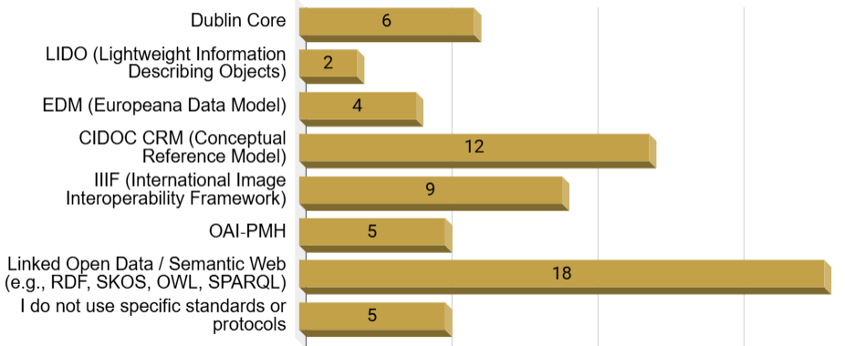
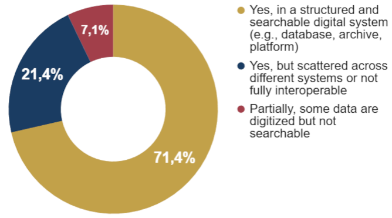
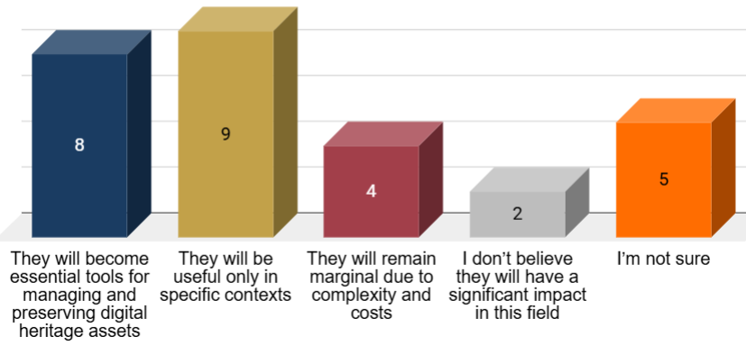

# Database managers and ICT specialists

Full visualisations for this profile are available in the dedicated Google Sheets tab.

This profile includes **29 respondents**. Database managers and ICT specialists represent the most infrastructure–oriented group in the survey, focusing on the design, maintenance, integration and governance of digital systems supporting cultural heritage data. Their work spans database administration, interoperability frameworks, cloud infrastructures, APIs, semantic modelling and digital platform management. Compared with other profiles, respondents in this group show the strongest engagement with structured data environments and interoperability concerns.

## 3.8.1 Digital infrastructures, monitoring and system management

Database managers and ICT specialists rely on a broad ecosystem of digital infrastructures centred on **databases**, **cloud platforms**, **APIs**, and **data–management systems**. Relational and non-relational databases, metadata repositories, and interoperability frameworks form the backbone of their workflows, while GIS platforms, linked–data environments and semantic technologies appear frequently among more advanced users.

Unlike many other professional groups, respondents in this profile are strongly oriented toward structured and automated workflows. Data collection and updating processes often rely on APIs, synchronised repositories or scheduled ingestion pipelines, while real–time monitoring and automated logging are significantly more widespread than in the rest of the survey population.

Monitoring practices focus on system integrity, metadata consistency, server reliability and interoperability performance. Respondents frequently employ dashboards, automated alerts, backup systems and validation procedures to supervise data quality and accessibility.

The main difficulties concern scalability, interoperability and organisational fragmentation. Respondents point to incompatibilities between legacy systems, inconsistent metadata structures, and the complexity of integrating heterogeneous institutional datasets. Limited institutional coordination and insufficient long–term planning also emerge as persistent barriers to maintaining coherent digital infrastructures.

## 3.8.2 Data types, formats and interoperability standards

Database managers and ICT specialists work with an extremely heterogeneous range of information (**Figure 31**), reflecting their role as integrators across institutional ecosystems. Their datasets combine metadata records, geospatial information, multimedia files, 3D models, sensor outputs, administrative data and linked semantic resources.

  
  
<em>Figure 31. Data type.</em>

Compared with most other profiles, this group shows the strongest adoption of structured formats. XML, JSON, RDF, SQL databases and API–driven formats are widely used alongside standard document and multimedia files. However, proprietary formats and fragmented local structures remain common, especially when integrating external institutional repositories.

Interoperability standards are significantly more established than in other profiles. Respondents report using **CIDOC CRM**, **Dublin Core**, **IIIF**, **Linked Open Data frameworks**, **OGC standards**, and API specifications. Nevertheless, adoption remains uneven across institutions, and several respondents note that standardisation efforts are often constrained by legacy systems or limited organisational support.

## 3.8.3 Data accessibility, collaborative systems and sharing barriers

Data accessibility among database managers and ICT specialists is comparatively high (**Figure 32**). Many respondents work within structured, searchable repositories or institution–wide infrastructures, though fragmented storage across multiple disconnected systems remains a widespread issue. Cloud–based solutions and shared repositories are common, but fully unified environments remain relatively rare.

  
  
<em>Figure 32. Data accessibility.</em>

Collaborative platforms and shared digital workspaces are extensively used, particularly through institutional systems and interoperability frameworks connecting multiple repositories. Open–source infrastructures and Git–based collaboration environments also appear more frequently in this profile than in others.

Despite this advanced infrastructure, data–sharing challenges remain substantial (**Figure 33**). The most widespread problems concern interoperability between systems, metadata inconsistencies, and institutional fragmentation. Legal and intellectual property issues are present but less dominant than technical and organisational barriers. Respondents also highlight the difficulty of maintaining sustainable infrastructures over time, especially when long–term funding or institutional commitment is uncertain.

  
  
<em>Figure 33. Main difficulties in sharing data.</em>

## 3.8.4 3D models, simulations and system integration

Database managers and ICT specialists interact with **3D models** and **digital simulations** primarily as data infrastructures rather than as interpretative or visualisation tools. Many respondents manage storage, interoperability, or dissemination pipelines for 3D assets, even when they are not directly involved in producing them.

3D models are widely handled within repositories, cloud environments or APIs, while simulations are more selectively integrated, typically in projects involving Digital Twins, monitoring systems or predictive analytics.

The main integration challenges concern scalability and compatibility. Respondents frequently report difficulties synchronising heterogeneous systems, integrating real–time data streams, and ensuring long–term preservation of complex digital assets. Metadata harmonisation and semantic consistency also emerge as critical issues, especially when data originate from multiple institutions or disciplines. Compared with other profiles, resistance to digital technologies is reported less frequently, suggesting that the obstacles are primarily infrastructural rather than cultural.

## 3.8.5 Digital Twins and future infrastructures

Database managers and ICT specialists see **Digital Twins** primarily as integrated infrastructures for data interoperability, monitoring and decision support. Respondents emphasise the importance of linking heterogeneous datasets – sensor data, metadata, geospatial information, documentation and 3D assets – into unified, continuously updated systems.

The most desired functionalities for Reactive Digital Twins (**Figure 34**) include real–time data synchronisation, interoperability between repositories, predictive analytics, automated alerts, and integrated dashboards for system monitoring. Respondents also value version control, semantic consistency and long–term preservation mechanisms, reflecting a strong infrastructure–oriented perspective on Digital Twin ecosystems.

  
  
<em>Figure 34. Information or support expected from Reactive Digital Twins.</em>

Future expectations are highly positive overall. Most respondents consider Digital Twins likely to become central infrastructures for cultural heritage data ecosystems, though several note that implementation will depend heavily on institutional investment, interoperability standards and sustainable governance models.

## 3.8.6 Cross analysis insights

All detailed cross–tabulations for this profile are available in the corresponding Google Sheets tab.

These insights derive from comparative cross-tabulations across the profile-specific tables. The analysis focuses on relative response distributions within each row to identify structural patterns across technological groups, rather than relying on absolute counts.

- Database managers and ICT specialists display the strongest alignment between digital technologies and structured data formats (**Figure 35**). Relational databases, APIs, semantic repositories and cloud systems are consistently associated with XML, JSON, RDF and SQL–based structures, indicating mature interoperability practices compared with most other profiles.

  
  
<em>Figure 35. Cross-tabulation (digital technologies vs. data formats).</em>

- Despite this higher level of standardisation, fragmented ecosystems remain widespread. Proprietary formats, disconnected repositories and inconsistent metadata schemas continue to coexist alongside structured infrastructures, especially in projects involving multiple institutions or legacy systems.

- Automated and real–time data pipelines are substantially more common in this profile than in others. APIs, synchronised repositories and monitoring dashboards are strongly associated with continuous data ingestion and system supervision, highlighting the infrastructural nature of ICT workflows.

- Sharing barriers are predominantly technical and organisational rather than legal. Interoperability failures, metadata inconsistency and system fragmentation emerge as the dominant constraints, while intellectual property concerns play a comparatively smaller role.

- Digital Twin expectations are deeply infrastructure–oriented. Respondents consistently prioritise interoperability, synchronisation and predictive monitoring capabilities over communication or storytelling functions, reinforcing the perception of Digital Twins as integrated data ecosystems rather than visualisation tools alone.

- The strongest relationships in the cross–analysis emerge between semantic technologies, APIs and structured data environments, confirming that interoperability maturity depends not only on standards adoption but also on the existence of scalable governance and maintenance infrastructures.
