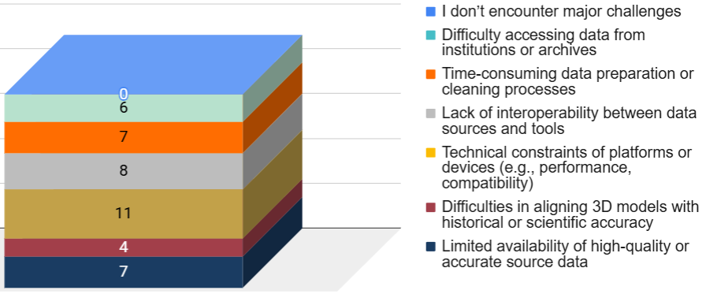
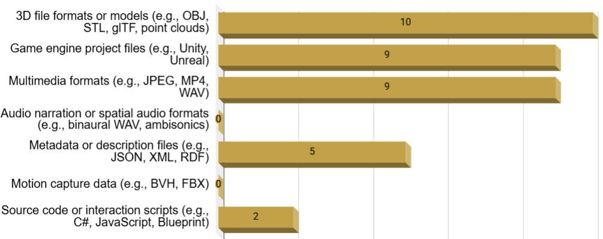
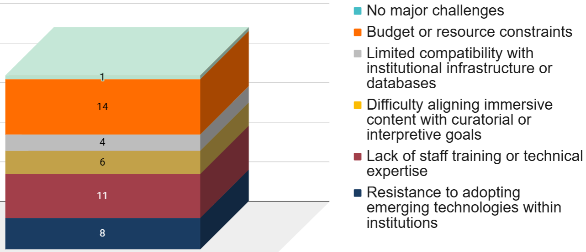
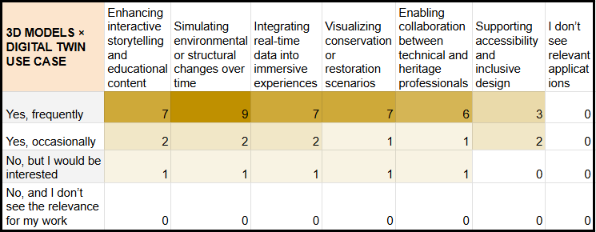

# VR–AR specialist

Full visualisations for this profile are available in the dedicated Google Sheets tab

[VR–AR specialist – Google Sheets tab](https://docs.google.com/spreadsheets/d/1ifbaVbV-15UzVqxh6cpbuYBN5vWL3QNB4iis-Lq3_gk/edit?gid=1068924566#gid=1068924566)

This profile includes **15 respondents**. VR/AR specialists represent a small but highly technical group within the survey. Their workflows combine immersive technologies, 3D content creation, and interactive experience design, but adoption patterns vary widely depending on project scale, available data, and institutional support. The limited number of respondents means patterns must be interpreted cautiously, yet several consistent trends do emerge.

## 3.9.1 Digital tools, data acquisition, monitoring, challenges

VR/AR specialists rely primarily on **3D modelling software**, **game engines**, and **VR/AR systems**, forming the core technological stack behind most immersive cultural heritage applications. **Photogrammetry** and immersive storytelling platforms complement this toolkit, while more advanced or specialised systems – such as structured–light scanners or motion–capture rigs – appear only in a minority of cases.

Real–time data use is limited: most respondents work with static or pre–recorded datasets, and only a very small subset integrates live or frequently updated information into immersive applications. 

Practices to monitor performance, usage or experience of VR/AR applications follow the same trend: some professionals use interaction–tracking or performance–monitoring tools, but a comparable share does not rely on any digital monitoring system at all.

The challenges reported when working with data are primarily technical and infrastructural (**Figure 36**). Respondents cite platform constraints, data interoperability issues, and the substantial time required for data preparation and cleaning. Additional difficulties include limited access to accurate or high–quality reference data and institutional barriers to obtaining source material. Notably, no respondent indicated an absence of challenges, underscoring the persistent complexity of VR/AR work in the heritage sector.

  
  
<em>Figure 36. Working with data main challenges.</em>

## 3.9.2 Data types, formats, standards

VR/AR specialists work with a focused but technically demanding set of data types. **3D models** are the central asset, forming the foundation of most immersive experiences, and are commonly complemented by photographic material, audiovisual content, and selected historical or archival sources. Only a small minority engage with sensor–based or interaction data, reflecting the predominantly static nature of current VR/AR production pipelines.

The formats used to manage these materials are similarly concentrated (**Figure 37**). Standard 3D formats and game–engine project files dominate the workflow ecosystem, while images, video, and multimedia assets provide supporting layers for immersive applications. More structured or interoperable formats remain marginal, indicating that VR/AR production environments continue to rely heavily on software–specific pipelines.

  
  
<em>Figure 37. Data formats.</em>

Use of standards and interoperability protocols is relatively limited. A minority of respondents report using metadata standards or linked–data frameworks, while many rely on project–specific workflows optimised for production rather than long–term interoperability or preservation.

## 3.9.3 Data accessibility, collaboration, and sharing challenges

Data accessibility among VR/AR specialists is highly variable. Some respondents operate within well–structured project repositories or institutional systems, while many manage assets across fragmented environments composed of local storage, cloud repositories, and software–specific platforms. This fragmentation reflects the hybrid nature of immersive production pipelines.

Collaborative workflows are widespread and often depend on multidisciplinary coordination involving developers, designers, curators, and heritage specialists. Respondents report using both institutional infrastructures and external collaborative platforms to exchange assets and coordinate production activities.

Data–sharing barriers remain significant. Respondents identify compatibility problems between platforms and software ecosystems, limited interoperability, and the complexity of preparing assets for reuse or external dissemination. Intellectual property concerns and restricted access to source material also emerge frequently, especially for projects involving cultural institutions or commercial partnerships.

## 3.9.4 3D models, simulations, and integration challenges

Use of **3D models** is nearly universal within this profile and represents the core of most immersive heritage workflows. Respondents frequently rely on reconstructed environments, photogrammetric assets, or interactive 3D scenes to support interpretation and user engagement.

**Digital simulations** are used less frequently but still represent a growing area of practice, with many respondents expressing interest even if not yet applying them directly.

Integration challenges reflect the distance between immersive development workflows and institutional heritage systems (**Figure 38**). Limited staff training and technical expertise emerge as the most widespread barrier, followed by budget constraints that restrict experimentation with advanced tools. Respondents also point to difficulties aligning immersive outputs with curatorial or interpretive objectives and to uneven compatibility with existing infrastructures or databases. Only one participant reports no major obstacles, confirming that integration remains a structural challenge for VR/AR work in cultural heritage.

  
  
<em>Figure 38. Main challenges in integrating digital technologies.</em>

## 3.9.5 Digital Twin expectations and future perspectives 

VR/AR specialists show a strong openness toward **Digital Twin** applications, particularly where they can enhance interpretive depth and experiential quality. Respondents see clear potential in areas such as interactive storytelling, educational engagement, and the integration of real–time information into immersive environments. Interest is also high in using Digital Twins to simulate environmental or structural change and to visualise conservation scenarios within virtual or augmented environments.

Expectations for a **Reactive Digital Twin** focus on dynamic capabilities such as real-time data integration, visualisation of historical states, predictive simulations, and tools for user behaviour analysis or scenario-based interpretation. These functions are seen as supporting both creative development and stronger connections between immersive content and the physical heritage it represents. Digital Twins are increasingly perceived as a relevant component of immersive heritage design and management.

## 3.9.6 Cross–analysis insights

All detailed cross–tabulations for this profile are available in the corresponding Google Sheets tab

[VR–AR specialist – Google Sheets tab](https://docs.google.com/spreadsheets/d/1ifbaVbV-15UzVqxh6cpbuYBN5vWL3QNB4iis-Lq3_gk/edit?gid=1032894981#gid=1032894981)

These insights derive from comparative cross-tabulations across the profile-specific tables. The analysis focuses on relative response distributions within each row to identify structural patterns across technological groups, rather than relying on absolute counts.

- The VR/AR workflow is strongly centred on **3D pipelines**, with 3D modelling software, game engines and photogrammetry showing almost identical distributions and consistent links to multiple data types. This suggests a relatively compact technological configuration.

- Real-time integration remains limited across technologies, but a distinction emerges between production tools and experiential platforms. While modelling, scanning, and photogrammetry workflows rely on static or pre-recorded datasets, AR, VR, and immersive storytelling environments show a comparatively higher – though still moderate – incidence of dynamic or project-based real-time inputs.

- Monitoring challenges in the VR/AR profile are largely operational, with recurring references to data preparation, interoperability, and the availability of reliable source material. Technical constraints of platforms and devices, however, remain equally salient in experience-oriented tools, indicating that bottlenecks are distributed across both data and infrastructure layers.

- The formats landscape is relatively narrow and structured around **3D file formats** and **game engine project files**, with standard multimedia supporting core assets. In contrast, metadata standards, motion-capture formats, and spatial-audio formats are rarely used. This indicates that immersive outputs rely on a concentrated technical stack, with limited diversification of underlying data structures.

- In the case of **3D models** (**Figure 39**), perceptions of Digital Twin applications vary sharply across user groups, with frequent users attributing consistently broader relevance across use cases. For simulations, by contrast, the distribution of perceived applications is more even across levels of use.

  
  
<em>Figure 39. Cross-tabulation (use 3D models vs.areas where Digital Twins are considered useful).</em>

