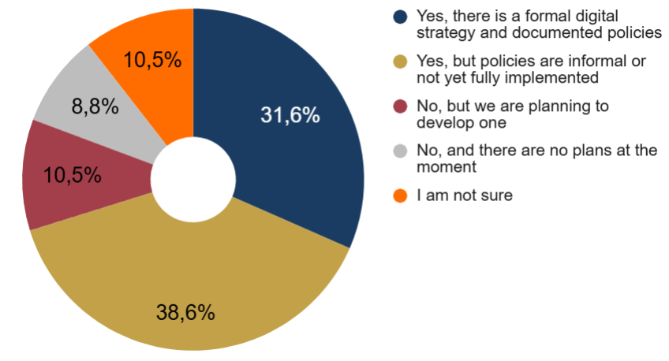
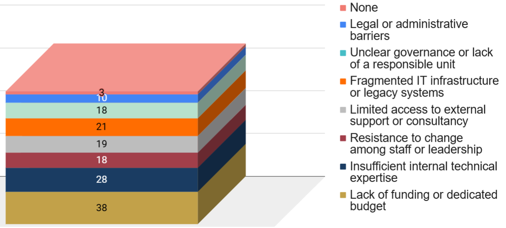
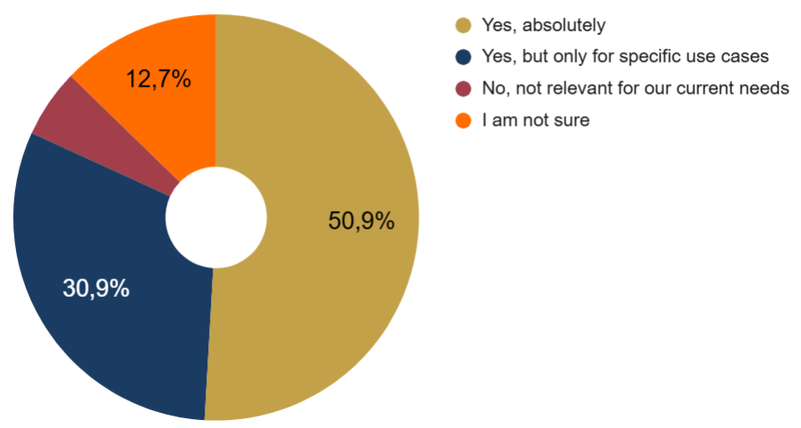

# 3.10 Administration and Management

Full visualisations for this profile are available in the dedicated Google Sheets tab

[Administration and Management – Google Sheets tab](https://doi.org/10.5281/zenodo.20682086)

Unlike the other professional profiles, Administration and Management respondents (57 in total) answered a much smaller set of questions focused on institutional strategy, governance, policies, and organisational readiness. The section does not include technical blocks on tools, data types, standards, or workflow practices. As a result, the analysis is intentionally more concise and strategic in nature, reflecting the managerial scope of this profile and the broader, policy–oriented perspective of the respondents.

Institutional leaders report a broad but uneven adoption of digital services, with heritage databases and documentation platforms emerging as the most widely implemented solutions. However, the presence of a structured digital strategy remains inconsistent (**Figure 40**): only a minority operate with formal policies, while most institutions rely on informal guidelines or are still in an early planning phase.

  
  
<em>Figure 40. Adoption of digital strategy or policy.</em>

The main obstacles to scaling digital services are primarily structural (**Figure 41**). Funding shortages are the most frequent barrier, followed by limited internal expertise and fragmented or outdated IT infrastructures. Governance challenges – such as unclear responsibilities or resistance to change – also play a significant role in slowing progress.

  
  
<em>Figure 41. Main obstacles in adopting digital services.</em>

Interoperability remains a mixed landscape. While some institutions apply internal or sector standards, many still face fragmented systems or lack a structured approach to integration. Despite this, attitudes toward data sharing are generally positive, though often constrained by case–by–case decision processes rather than systematic openness.

Interest in advanced technologies is high (**Figure 42**). Many institutions express a clear need for guidance on emerging tools, including Digital Twins, and see potential value in their use for strategic planning, risk assessment, and decision–making – though typically within targeted or priority–driven scenarios rather than for universal adoption.

  
  
<em>Figure 42. Potential value of Digital Twins for planning and decision-making.</em>

