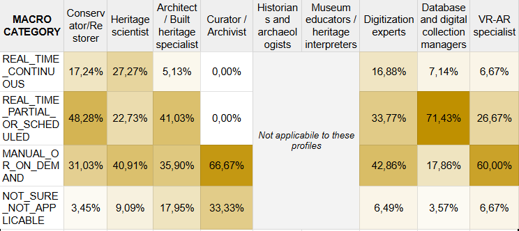

## 5.1 Digital tools, monitoring practices, and workflow challenges

Across all profiles, the cross–analysis reveals one main insight: digital activity is strongly segmented by disciplinary role, with each group concentrating on distinct parts of the workflow (e.g., acquisition, monitoring, documentation, organisation). This fragmentation does not indicate different levels of digital maturity but rather **parallel digital ecosystems** that evolve independently, making cross–role integration structurally difficult even within the same institution.

Only two roles (Figure 47) – **database managers** and **conservators** – rely substantially on **real–time or regularly updated data**. All other profiles remain predominantly manual, confirming that real–time data flows are an exception in the sector rather than a shared practice.

  
  
<em>Figure 47. Methods to collect data.</em>

**Costs** and **data–interpretation difficulties** consistently emerge as the two dominant barriers across profiles when it comes to monitor physical, environmental or structural conditions. Costs represent the highest constraint for most roles, while data interpretation peaks particularly among heritage scientists.

The monitoring-related questions included in this block were only relevant for a subset of profiles (**Conservators, Heritage Scientists, Architects, Curators**). Other profiles received different role-specific questions in the equivalent section of the survey (e.g., 3D/VR tools, digitization workflows, data-management systems), and are therefore analysed in their respective profile sections. Only comparable dimensions are included here.

Monitoring tools patterns align closely with the challenges reported. The groups that rely most on environmental or continuous monitoring – mainly conservators and heritage scientists – are also those who face the highest levels of **cost pressure**, **data–interpretation difficulties**, and integration issues. Architects, whose monitoring activity focuses almost exclusively on structural systems, report a similar combination of high costs and interpretation challenges, consistent with the technical demands of structural assessment. Curators, by contrast, operate largely through manual or non–digital workflows, and their barriers reflect limited access to tools rather than difficulties in using them.

Overall, the cross–analysis shows that **monitoring intensity and monitoring difficulties grow together**: the more a role depends on digital monitoring, the more it encounters structural constraints that institutions are not equipped to manage.
