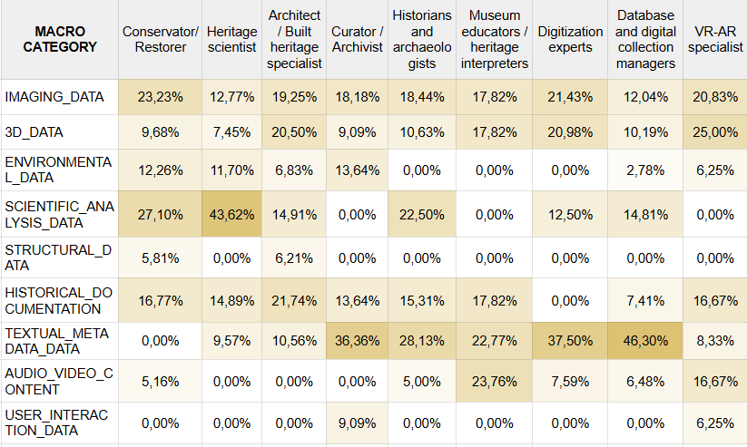

## 5.2 Data types, data formats, and interoperability practices

Across profiles, this block reveals a clear picture (Figure 48):

  
  
<em>Figure 48. Data types.</em>

Although the volume of digital data is high, it is distributed across isolated disciplinary domains. Each professional group works within its own data ecosystem, shaped by its methods and responsibilities, with minimal overlap with the others. As a result, institutions often accumulate large amounts of digital information that remain internally consistent but externally incompatible.

Two transversal tendencies emerge.

1. **Imaging** is the only data type consistently used across almost all profiles, while **metadata–driven documentation** dominates only in humanities–oriented roles – creating two parallel informational poles that rarely intersect.

2. Likewise, **scientific data** and **3D data** appear as mutually exclusive specialisations: no profile shows high engagement in both, reinforcing the separation of technical and analytical domains.

Formats mirror these divides: scientific imaging, CAD/GIS files, multimedia content, and semantic formats remain confined to specific expert clusters. Standards and interoperability protocols show the strongest fragmentation of all. Adoption is uneven and generally low, with only small pockets of role–specific usage and no shared framework connecting the different domains. This structural divergence explains why integration issues re–emerge in every other section of the survey.

In short, this block shows that **diversity of data is not the problem – fragmentation is**. Institutions do not lack digital content: they lack shared structures capable of linking it across roles.
