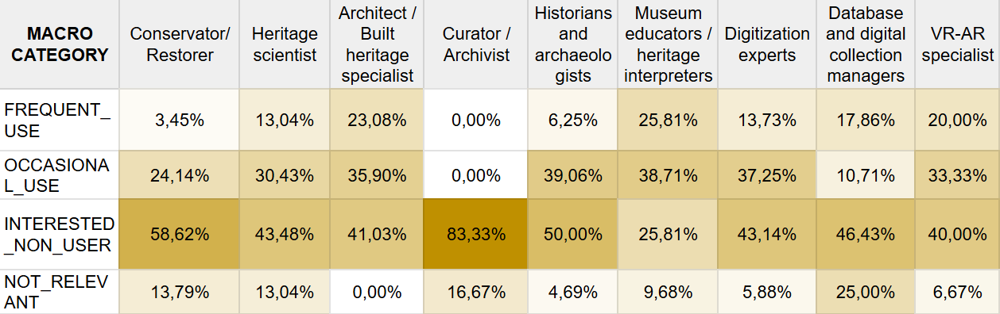

## 5.4 3D models, simulations and integration challenges

Across profiles, the adoption of 3D models and digital simulations follows a clear disciplinary gradient. Roles that specialise in digitisation, spatial documentation, or immersive technologies show the highest levels of practice, while others engage with these tools only occasionally or express interest without substantial hands–on experience. As seen in previous blocks, each professional group approaches 3D workflows from within its own methodological context, resulting in parallel rather than convergent trajectories.

Two transversal tendencies emerge.

1. First, **interest in 3D technologies is consistently higher than actual usage** across most profiles, signalling a sector that recognises the potential of these tools but has not yet integrated them into everyday workflows.

2. Second, **simulations remain even less widespread than 3D models** (Figure 50), confirming that scenario–based analysis is still perceived as an advanced, specialist capability rather than a common instrument for planning or evaluation.

  
  
<em>Figure 50. Digital simulation usage.</em>

The challenges in integrating digital technologies into professional workflow reinforce this picture of partial adoption. Integration difficulties appear systematically across technical and non–technical profiles alike, suggesting that institutions lack the organisational and technological conditions required to embed 3D outputs into wider decision–making processes. Costs and resource constraints continue to act as structural barriers, while workflow compatibility issues – particularly the difficulty of connecting 3D outputs with existing systems – affect even the more digitally mature roles.

Resistance to change or lack of training emerges only in specific contexts and is not the primary obstacle. The core issue lies instead in the **absence of shared pipelines capable of receiving, managing, and reusing 3D or simulation–based results**. As a consequence, 3D technologies tend to remain confined within the domains that produce them, circulating only rarely across institutional boundaries.

In short, this block shows a sector that is conceptually aligned with the potential of 3D and simulation technologies but structurally unprepared to absorb them. The interest exists, the tools exist, and expertise is present in several roles – but the conditions that would allow these practices to scale and interconnect across profiles are still missing.
