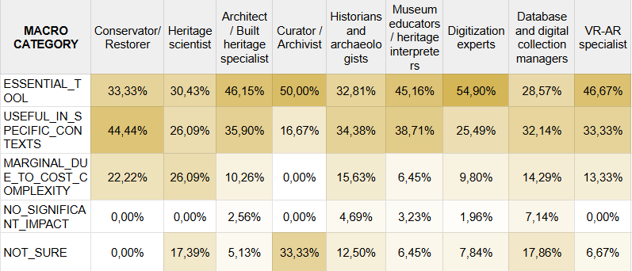

## 5.5 Digital Twins: perceived usefulness, expectations, and future adoption

Across profiles, **Digital Twins are perceived as a promising but still emerging framework**, with expectations that vary more by professional culture than by technical experience. While usage is largely absent across all roles, the conceptual understanding of their value is remarkably consistent: respondents recognise the potential of Digital Twins to consolidate data, support monitoring, and improve decision–making, even when they have limited familiarity with the underlying technologies.

Two transversal tendencies emerge.

1. **First, the most widely shared expectation concerns data integration**: almost all profiles view Digital Twins as a unifying layer able to connect information that is currently dispersed across separate systems and roles.

2. **Second, the perceived usefulness of simulation – predictive, diagnostic, or exploratory – grows significantly among the profiles already engaged with 3D or scientific workflows**, suggesting that Digital Twins are intuitively mapped onto existing disciplinary practices.

Differences appear in the specific functions emphasised. Conservators and heritage scientists prioritise **real–time monitoring and condition–based alerts**, architects focus more on **planning and scenario exploration**, humanities–oriented roles highlight **documentation and knowledge organisation**, and educators and VR/AR specialists emphasise **public interpretation and engagement**. These differences reflect professional missions rather than divergent visions of the technology.

Future expectations are surprisingly coherent across profiles (Figure 51). Most respondents frame Digital Twins as tools that will become **essential or contextually useful in the coming years**, with only minor reservations linked to costs or implementation complexity. The shared optimism indicates that Digital Twins are perceived less as a niche technical innovation and more as a **structural evolution of digital practice in cultural heritage**.

  
  
<em>Figure 51. Expected future evolution of Digital Twin adoption.</em>

In short, this block shows that **Digital Twins are not limited by a lack of interest or conceptual clarity**. The real challenge is infrastructural: institutions recognise the value of an integrative, simulation–based framework, but the organisational and technical conditions required to sustain it are still unevenly distributed. The sector is ready in principle – less in practice.
